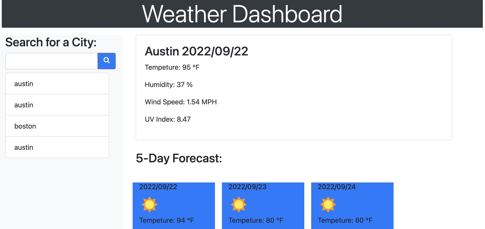

# weather-dashboard

## User Story
AS A traveler
I WANT to see the weather outlook for multiple cities
SO THAT I can plan a trip accordingly

## Acceptance Criteria
GIVEN a weather dashboard with form inputs
WHEN I search for a city
THEN I am presented with current and future conditions for that city and that city is added to the search history
WHEN I view current weather conditions for that city
THEN I am presented with the city name, the date, an icon representation of weather conditions, the temperature, the humidity, and the wind speed
WHEN I view future weather conditions for that city
THEN I am presented with a 5-day forecast that displays the date, an icon representation of weather conditions, the temperature, the wind speed, and the humidity
WHEN I click on a city in the search history
THEN I am again presented with current and future conditions for that city

## Difficulties
Originally my first layout in html was very cluttered. I eventually found a version via a online tutorial on how to make the the "wireframe" look like it was suppose to. I had multiple divs missing the appropriate tags to make the layout work. Also trying to figure out how to make the functions work with each other was a tasks as well. Via the tutorial I found methods that worked with the init, render, storeCities, and api to work together. Styles was hard as well until I used bootstrap and looked up how to properly attach it to my html and js files. The biggest challenge and learning experience was definitely researching properly and seeing wheat has worked for other people to get this accomplished. Also linking the appropriate 3rd party scripts took some time and research as well.

## ScreenShot of site.

